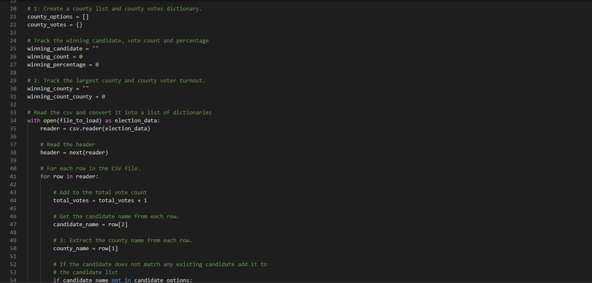
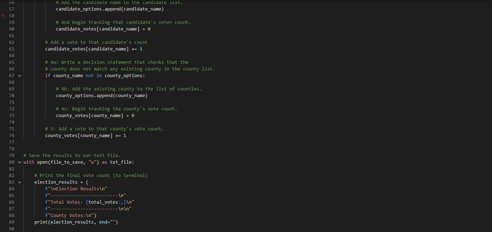
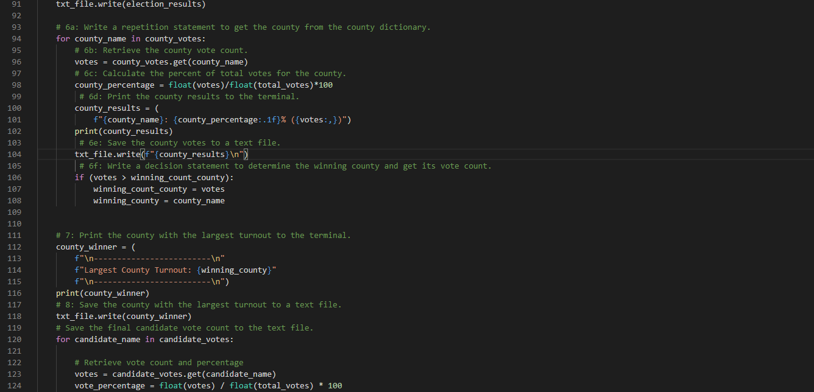
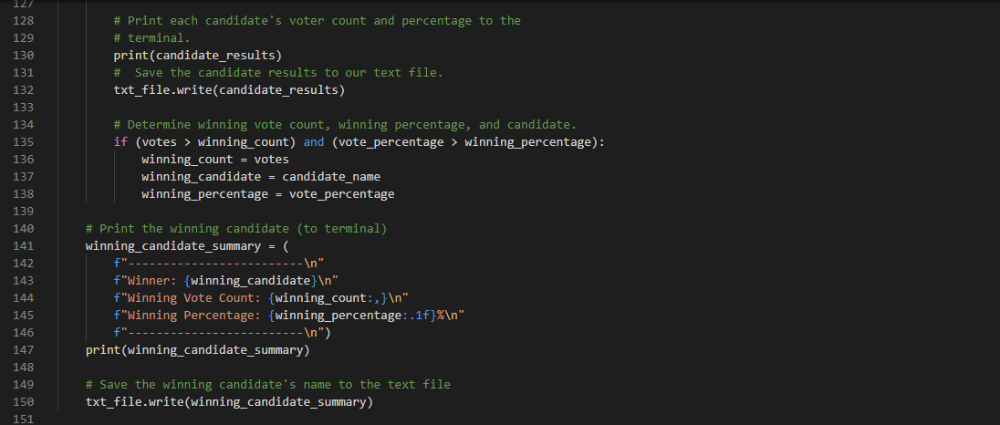
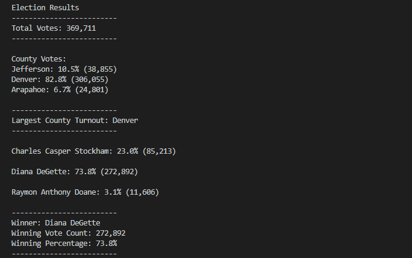
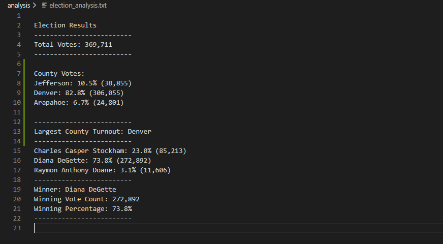

# Election_Analysis
This project is meant to calculate election results and determine the winner and similar information.
## The focus of the project was to take an election and to determine the winner, then we were tasked to also determine which counties participated the most and which participated the least.
The election that was analyzed covered three counties, Jefferson, Denver, and Arapahoe. We first started by going through the election results datasheet and determining the total votes. Next was to find how many candidates recieved votes in the election. After finding the number of candidates, we then went through and totaled the number of votes each candidate got in the election. The information gathered so far can help to show the winner of the election by using if conditions and testing to see who out of the candidates had the highest number of votes. After all this was done we needed to calculate the percentage each candidate had out of the total votes. This was done by taking the votes given to the candidate and dividing that by the total and multipling that by 100. The other hugely important thing to find in the election reults datasheet is the counties that voted. In order to find the information needed, it is very similar to the candidates script of making variables for certain conditions to be met. Once all of the votes were counted from each county, we needed to find which county played the biggest role. This is done in a similar way of finding which candidate won. Make a variable set it equal to zero then test of the current county has a high vote. If so then that county wins for the time being until no more counties can be tested.

## Election Audit Results
### Total Votes: 369,711
- County Votes:
  - Jefferson: 10.5% (38,855)
  - Denver: 82.8% (306,055)
  - Arapahoe: 6.7% (24,801)
    - Largest County Turnout: Denver
- Candidate Votes:
  - Charles Casper Stockham: 23.0% (85,213)
  - Diana DeGette: 73.8% (272,892)
  - Raymon Anthony Doane: 3.1% (11,606)
- Winner of the Election:
  - Winner: Diana DeGette
  - Winning Vote Count: 272,892
  - Winning Percentage: 73.8%
---

## Election Audit Summary
This script can help to save time and money, it does what would take days maybe even weeks seconds or minutes to do. Not only does this script provide the information shown above but also can be altered in the future for more important elections, it can be changed to also determine political party if given the information in the datasheet and show how much of the county voted for which parties. The script can also be given the honor of determining the winner of the presidental election by adding the electoral college to the script this would require a detailed datasheet but could save so much time and money and give very accurate information.
